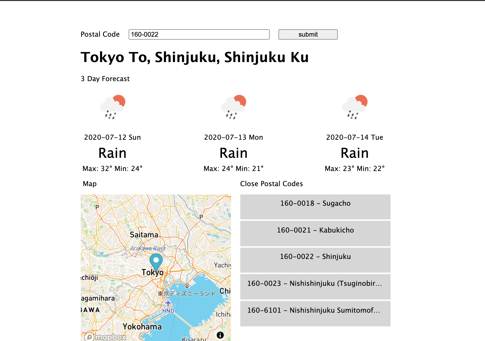

# Japan Postal Code

## Project Requirements
- latest npm
## Start Instructions


Inside the `postal_code` folder run 
```
npm install
``` 
to download all project depedencies.

Then run 
```
npm run start
``` 
to start the project. The webpage will be available at `localhost:3000`
